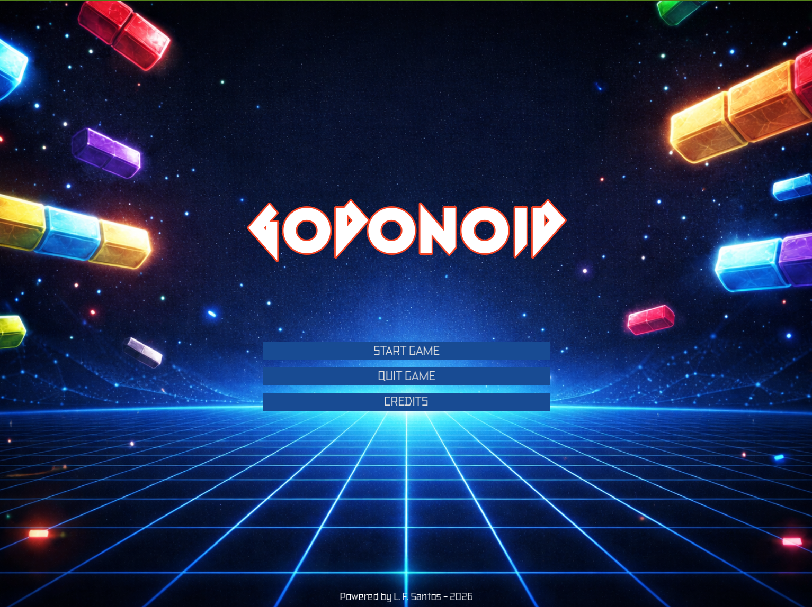
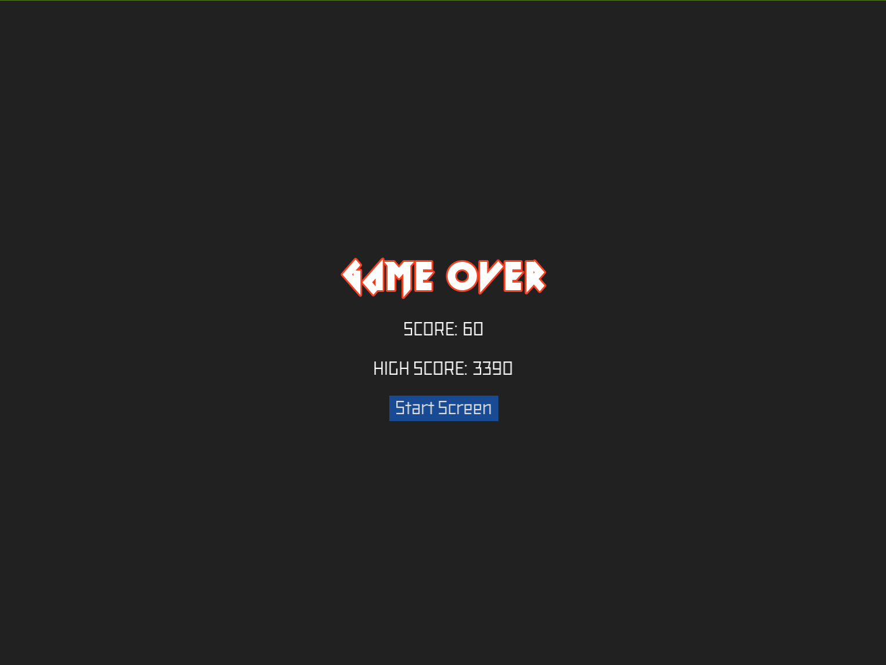
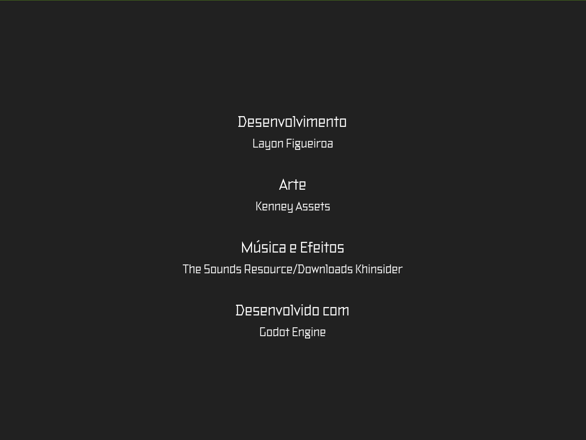

# 🧱 Godonoid


**Godonoid** é um clone do clássico **Arkanoid**, desenvolvido utilizando a **Godot Engine**.  
Neste jogo, você controla um paddle e precisa destruir todos os blocos, evitando deixar a bola cair!

---

# 🎮 Como Jogar

| Tecla | Ação |
|------|------|
| **Setas** | Movem o paddle |
| **Espaço** | Libera a bola |
| **Enter** | Pausa o jogo |

🎯 **Objetivo:**  
Destruir todos os blocos da fase.

Você começa com 3 vidas.
Se perder todas → **Game Over** 💀

---

# 🧠 Mecânicas do Jogo

- Sistema de física com colisões e ricochete
- Aumento progressivo da velocidade da bola
- Sistema de vidas
- Sistema de pontuação
- Power-ups (bônus especiais)
- Pausa do jogo

---

# 🛠️ Tecnologias Utilizadas

- **Godot Engine 4.x**
- **GDScript**

---

# 📸 Screenshots

<br><br>
<br><br>


---

# 📦 Como Rodar o Projeto

Clone o repositório:

```bash
git clone https://github.com/layon-figueiroa/godonoid.git
